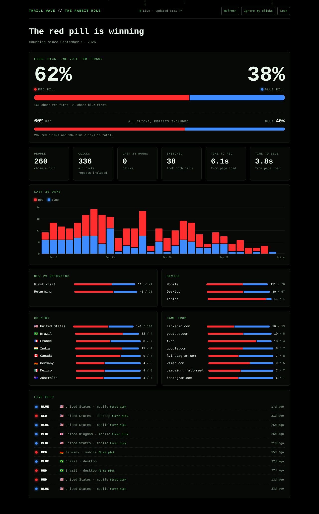
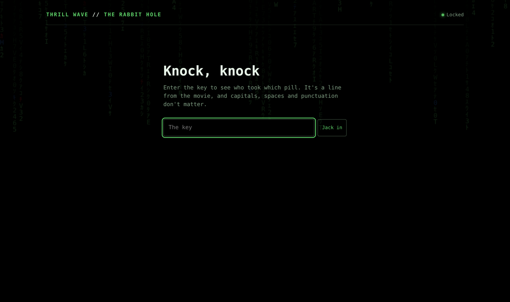
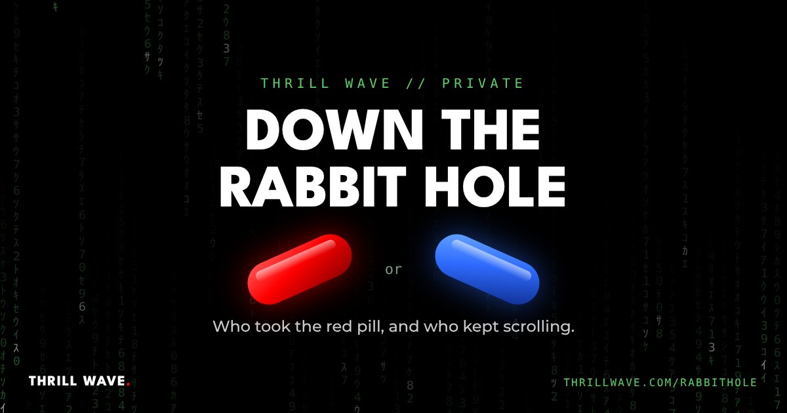
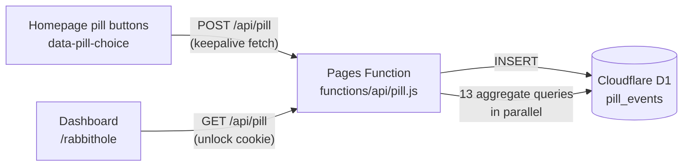

# Thrill Wave website: pill analytics

**Red pill / blue pill click analytics for [thrillwave.com](https://thrillwave.com), built on Cloudflare Pages Functions and a D1 (SQLite) database, with a private Matrix-style dashboard.**

The Thrill Wave homepage opens with a choice straight out of *The Matrix*: **Take the red pill** (a hidden terminal-style site) or **Keep scrolling** (the blue pill). This project records which one each visitor picks and shows the results on a password-protected dashboard at `thrillwave.com/rabbithole`.

*The dashboard, shown with demo data.*

## What it does

- **Counts every pick** from a tiny first-party beacon on the homepage, with no third-party analytics, cookies or trackers.
- **Separates people from clicks.** The headline split counts each visitor once, by their first pick, so nobody can tip the result by clicking ten times. A second bar shows every click, repeats included.
- **Answers the fun questions:** how many people took both pills, how long people hesitate before each choice, whether first-time visitors pick differently from returning ones, and which device, country, referring site or campaign they came from.
- **Shows a 30-day trend** as stacked bars bucketed in the viewer's own time zone, plus a live feed that refreshes every 30 seconds.
- **Stays private.** The dashboard sits behind a key screen. A correct key sets a year-long HttpOnly cookie (holding a hash, never the key), and one button locks the browser again. The page is noindexed and never appears in the site's build, sitemap or menu.
- **Keeps the team out of the numbers** with an "Ignore my clicks" switch that opts a browser out of tracking.

| Key screen | Link preview (iMessage, Slack, social) |
|---|---|
|  |  |

## How it works

| Piece | File | What it does |
|---|---|---|
| Beacon | [`public/js/pill-beacon.js`](public/js/pill-beacon.js) | Listens for clicks and middle-clicks on any element with `data-pill-choice`, dedupes per page view, and sends one small JSON event with `fetch(..., { keepalive: true })` so it survives the red pill's navigation away. |
| API | [`functions/api/pill.js`](functions/api/pill.js) | `POST` validates and stores an event. `GET` returns the aggregate stats to an unlocked browser. `GET ?health=1` reports whether the database is wired up, without exposing any data. |
| Dashboard | [`functions/rabbithole.js`](functions/rabbithole.js) | Serves the key screen or the dashboard as one self-contained page, with a per-request CSP nonce, no frameworks and no build step. Charts are hand-drawn SVG. |
| Schema | [`schema.sql`](schema.sql) | One table, two indexes. The API also creates it on first use. |

### A few details worth noting

- **First pick is decided inside the `INSERT`** with a `CASE WHEN EXISTS (...)` subquery, so two quick clicks can't both claim to be someone's first.
- **D1's `exec()` reads one statement per line**, so the schema runs through `db.batch()` once per worker instance instead.
- **Keys compare in constant time** on SHA-256 hashes, wrong guesses are slowed down, and keys are matched loosely (case, spaces and punctuation ignored) so a movie quote can be typed naturally.
- **Analytics never breaks the site.** Every failure path still answers `204`, so the pills always work.
- **Privacy by design:** a random browser ID in localStorage, the country from Cloudflare's edge, and no names, emails or IP addresses stored anywhere.

## Run it yourself

1. Create a D1 database: `npx wrangler d1 create pill-analytics`.
2. In your Cloudflare Pages project, go to **Settings → Bindings** and add the database as `TW_ANALYTICS`.
3. Under **Settings → Variables and secrets**, add a secret named `PILL_STATS_TOKEN`. That's the dashboard key.
4. Copy `functions/` into your Pages project, add `public/js/pill-beacon.js`, and put `data-pill-choice="red"` / `"blue"` on your buttons (see [`examples/buttons.html`](examples/buttons.html)).
5. Deploy, then visit `/api/pill?health=1` to check the wiring and `/rabbithole` to unlock the dashboard.

To try it locally: `npx wrangler pages dev <your-build-folder> --d1 TW_ANALYTICS=local --binding PILL_STATS_TOKEN=demo`, then open `http://localhost:8788/rabbithole?key=demo`.

## Built with

Cloudflare Pages Functions · Cloudflare D1 (SQLite) · vanilla JavaScript · hand-written SVG and CSS. No dependencies.

## About

Built by [Ari Everett](https://github.com/arieverett) for [Thrill Wave](https://thrillwave.com), a video production company in Phoenix, Arizona. The live version runs inside the Thrill Wave website; this repository is the standalone version of that feature.
